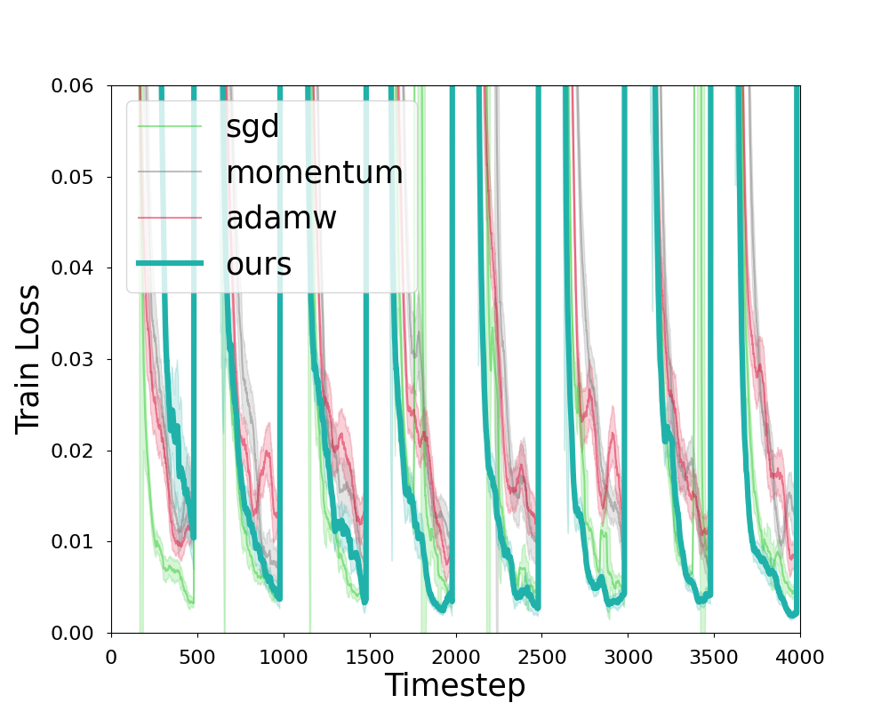

# Meta-Optimization
Hi! This is the codebase for our meta-optimization algorithm, built atop the nonstochastic control theory. We provide an implementation as an `optax` optimizer (found in the `jax_meta_opt` function in `meta_opt/jax_stuff/jax_meta_opt.py`) and plan to release a `pytorch` version soon.

## Results
We use common deep learning workloads (specifically the `AlgoPerf` implementations, see https://arxiv.org/abs/2306.07179 and https://github.com/mlcommons/algorithmic-efficiency) to benchmark this optimizer's performance against the current deep learning optimizers (SGD, Momentum, Adam, DoG, DoWG, Mechanic, D-Adaptation, and more). Our meta-optimization method is able to demonstrate improvement across training episodes, eventually matching the performances of many tuned benchmarks without the need for manual hyperparameter tuning; see the graph below for an example of a VGG-16 architecture trained on the CIFAR-10 dataset. 

## Instructions
To install the `meta_opt` package and its dependencies, simply ensure that Python version 3.10 is installed (through something like `brew install python@3.10` on mac or `sudo apt install python3.10` on linux). Then, you should be able to run `./setup.sh` (you may need to `chmod +x setup.sh` to make it executable), which will configure a virtual environment.

For each optimizer experiment we run, we have a separate `.py` file in the `configs/` folder that contains the configurations of (1) the experimental setup and (2) the specific optimizer we use. To launch the experiment, you may run `.venv/bin/python3 runner.py --config_path=ABSOLUTE_PATH_TO_CORRECT_CONFIG.py` with `ABSOLUTE_PATH_TO_CORRECT_CONFIG.py` replaced with an absolute path to the correct file in the `configs/` folder. This will start the experiment and write logs/results/checkpoints to a subdirectory of `experiments/`. 

For certain workloads, you may need to pre-download the corresponding TensorFlow dataset to the `datasets/` folder if it does not do so automatically.

## my TODOS
- [ ] run hella experiments and make some cool graphs
- [ ] implement many more baselines, including some that have Pytorch implementations?
- [ ] figure out correct counterfactual pmap and do a proper memory/runtime profiling
- [ ] figure out sharding of MetaOpt state
- [ ] do the pytorch implementation
- [ ] fix checkpointing 😔
- [ ] fix dataset automatic downloads
- [ ] add back ncf and gaps? they dont do too well, but maybe with adam disturbances they could?
- [X] ~~implement the `scale_by_adam` for disturbances~~
- [X] ~~add utilization logging and redo the way we write metrics~~
